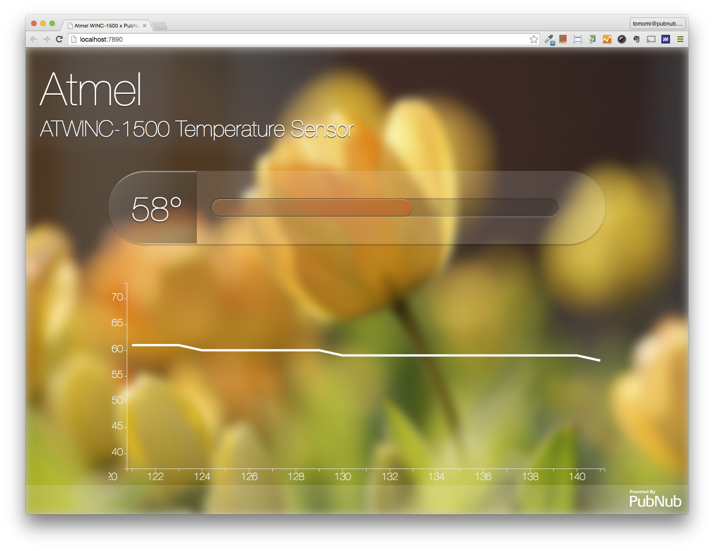

# Temperature Sensor Display Demo

This demo showcases a data visualization using the actual data sent from Atmel's ATWINC-1500 microcontroller.

## Turorial

TBD

## Demo

[Access it now!][demo]

This demo required a physical device running.

If you see a blank graph with purple background, the Atwinc-1500 is not running.

 

[demo]: http://pubnub.github.io/atmel-temperature-demo
